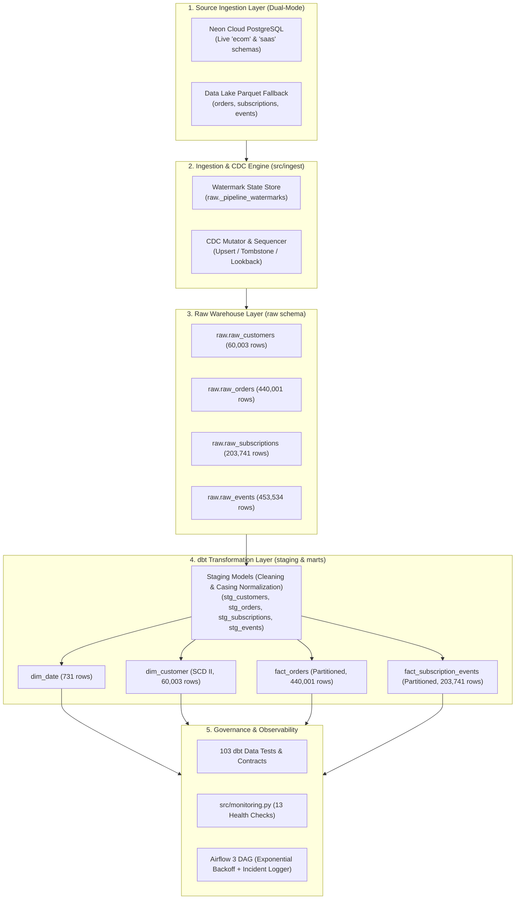
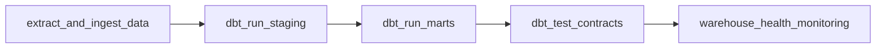

# End-to-End Analytics Data Platform

[](https://github.com/sidharthmenon626-lab/end-to-end-data-pipeline/actions)
[](https://docs.getdbt.com/)
[](https://airflow.apache.org/)
[](https://www.postgresql.org/)
[](https://github.com/astral-sh/ruff)
[](LICENSE)

> **Enterprise-Grade Analytics Data Platform** unifying live cloud PostgreSQL sources, recurring SaaS subscription lifecycles, and client telemetry events into an analytics-ready dimensional warehouse. Engineered for **1,150,000+ records** featuring dual-mode incremental ingestion (Live Neon Cloud PostgreSQL & Parquet lakehouse), Change Data Capture (CDC), canonical data hygiene normalization, Kimball star schema dimensional modeling (SCD Type II), range-partitioned fact tables, strict dbt schema contract enforcement (103 tests), Airflow 3 orchestration with automated incident response, and continuous observability monitoring.

---

## Table of Contents
1. [Business Problem & Analytical Scope](#business-problem--analytical-scope)
2. [End-to-End Architecture](#end-to-end-architecture)
3. [Dimensional Modeling & Schema Contracts](#dimensional-modeling--schema-contracts)
4. [Data Hygiene & Anomaly Remediation](#data-hygiene--anomaly-remediation)
5. [Ingestion & Incremental CDC Engine](#ingestion--incremental-cdc-engine)
6. [Orchestration, Retries & Incident Logging](#orchestration-retries--incident-logging)
7. [Data Health Observability & Monitoring](#data-health-observability--monitoring)
8. [CI/CD Automation](#cicd-automation)
9. [Quickstart & Reproducibility Guide](#quickstart--reproducibility-guide)
10. [Repository Structure](#repository-structure)
11. [Milestone Progress](#milestone-progress)

---

## Business Problem & Analytical Scope

Modern subscription-based commerce businesses operate across multiple fragmented data silos:
1. **Transactional Commerce**: High-velocity order placement, discounts, payments, and international shipping across 440,000+ orders.
2. **Recurring SaaS Subscriptions**: Complex MRR expansions, plan upgrades, downgrades, and churn lifecycles across 203,000+ events.
3. **Telemetry & Client Attribution**: Real-time user session behavior and platform interaction across 453,000+ clickstream events.
4. **Customer Evolution**: Demographic and account status mutations across 60,000+ accounts requiring historical attribution without data loss.

**The Solution**: This platform consolidates all 4 data domains into a single source of truth within a Kimball star schema warehouse, maintaining 100% historical fidelity through Slowly Changing Dimensions (SCD Type II), sub-minute batch ingestion latency, canonical data staging normalization, and automated drift detection.

---

## End-to-End Architecture



---

## Dimensional Modeling & Schema Contracts

The serving layer (`marts`) implements a Kimball Star Schema optimized for high-performance analytical queries, business intelligence, and reporting.

| Model Name | Type | Grain | Total Records | Key Strategy | Performance Optimization |
| :--- | :--- | :--- | :--- | :--- | :--- |
| **`dim_date`** | Dimension | 1 Calendar Day (2025-01-01 to 2026-12-31) | 731 | Integer Key (`YYYYMMDD`) | Static lookup spine; B-tree index on `date_day` |
| **`dim_customer`** | Dimension (SCD II) | 1 Customer Version (`customer_id` + `valid_from`) | 60,003 | MD5 Surrogate Key (`customer_sk`) | Historical state tracking; `is_current` index |
| **`fact_orders`** | Fact | 1 Order Transaction (`order_id`) | 440,001 | Natural Key (`order_id`) | Range-partitioned by month (`order_date_day`) |
| **`fact_subscription_events`** | Fact | 1 Subscription Lifecycle Mutation (`subscription_event_id`) | 203,741 | Natural Key (`subscription_event_id`) | Range-partitioned by month (`event_date_day`) |

### Enforced Data Contracts
All dbt models are governed by explicit schema contracts (`contract: {enforced: true}`), guaranteeing that column names, data types, and nullability constraints match production warehouse DDL specifications. 

* **103 Automated Tests Passing**:
  * 32 Unique grain tests
  * 48 Non-null constraints
  * 15 Referential foreign key integrity assertions
  * 4 Domain accepted-value checks
  * 4 Singular business invariant assertions (e.g., `discount_usd <= order_amount_usd`)

---

## Data Hygiene & Anomaly Remediation

During live cloud ingestion, source data contained real-world operational anomalies that were systematically neutralized in the staging transformation layer:

* **Order Status Canonicalization (`stg_orders.sql`)**: Raw operational values with mixed casing and status synonyms (`'SHIPPED'`, `'Shipped'`, `'delivered'`, `'DELIVERED'`, `'packed'`, `'paid'`, `'cancelled'`) are mapped into canonical analytical states (`'COMPLETED'`, `'PROCESSING'`, `'CANCELLED'`).
* **Subscription Tier Normalization (`stg_subscriptions.sql` & `stg_customers.sql`)**: Synonym variations (`'pro'`, `'professional'`, `'Enterprise'`, `'starter'`, `'basic'`, `'free'`) are canonicalized into standard uppercase business tiers (`PRO`, `ENTERPRISE`, `STARTER`, `FREE`).
* **Chronological Inversion Guard (`stg_subscriptions.sql`)**: 67 raw records where historical cancellations were logged before subscription starts (`cancelled_at < started_at`) are clamped to ensure non-negative subscription durations without dropping records.
* **Variable-Width Schema Hardening**: Widened warehouse staging types (`VARCHAR(64)` for international shipping countries) preventing truncation errors during live cloud loads.

---

## Ingestion & Incremental CDC Engine

The ingestion framework (`src/ingest`) is purpose-built for high-volume, reliable data transfer:
* **Dual Ingestion Engine**: Dynamically connects to live **Neon Cloud PostgreSQL** instances via SSL connection pooling across separate `ecom` and `saas` database credentials, with seamless fallback to local compressed Parquet files for offline sandboxing.
* **Persistent Watermarking**: Tracks high-watermarks per source in `raw._pipeline_watermarks` and `data/watermarks.json`, preventing redundant reads while allowing 30-minute late-arriving lookbacks.
* **CDC Mutation Ordering**: Ingestion sequences `_source_op` ('I', 'U', 'D') using record timestamps, ensuring late updates never overwrite newer customer records.
* **Soft Deletes**: Deletions are ingested as soft tombstones (`_is_deleted = TRUE`), preserving downstream auditability.
* **True Idempotency**: Re-running the pipeline on identical input produces **0 row delta** across all raw and dimensional tables (verified via `src/ingest/verify_idempotency.py`).

---

## Orchestration, Retries & Incident Logging

The pipeline is orchestrated by Apache Airflow 3 (`airflow/dags/pipeline_dag.py`) under the DAG ID `analytics_end_to_end_pipeline`:



### Operational Resilience Features
1. **Exponential Backoff Retries**: Tasks retry up to 3 times with exponential backoff (`delay = 30s * 2^attempt`, max 300s), shielding against transient network or lock contention.
2. **Automated Incident Logging**: On any task failure, `log_pipeline_incident` triggers automatically, writing structured incident alerts to `airflow/logs/incidents.log` with DAG name, task ID, run ID, and full traceback.
3. **Deterministic Backfills**: The DAG is parameterized with `logical_date`, supporting safe execution over any historical interval without state corruption (see [`airflow/BACKFILL.md`](airflow/BACKFILL.md)).

---

## Data Health Observability & Monitoring

The monitoring engine (`src/monitoring.py`) runs 13 automated health checks across 4 operational pillars, outputting human-readable dashboards and structured JSON (`data/monitoring_summary.json`):

```text
====================================================================================================
  WAREHOUSE OPERATIONAL MONITORING REPORT
  Overall Status: PASS | Mode: PRODUCTION
====================================================================================================
Pillar       | Metric Name                      | Actual Value     | Status   | Explanation
----------------------------------------------------------------------------------------------------
Freshness    | Event & Order Freshness Latency  | 0.0 hours        | [PASS]   | Latest event ts: 2027-03-28 | Latest order: 2026-09-28
Volume       | Volume Stability (raw_customers) | 60,003 rows      | [PASS]   | Actual: 60,003 vs Baseline: 60,003 (+0.00%)
Volume       | Volume Stability (raw_orders)    | 440,001 rows     | [PASS]   | Actual: 440,001 vs Baseline: 440,001 (+0.00%)
Volume       | Volume Stability (raw_subscriptions) | 203,741 rows | [PASS]   | Actual: 203,741 vs Baseline: 203,741 (+0.00%)
Volume       | Volume Stability (raw_events)    | 453,534 rows     | [PASS]   | Actual: 453,534 vs Baseline: 453,534 (+0.00%)
Volume       | Volume Stability (dim_customer)  | 60,003 rows      | [PASS]   | Actual: 60,003 vs Baseline: 60,003 (+0.00%)
Volume       | Volume Stability (fact_orders)   | 440,001 rows     | [PASS]   | Actual: 440,001 vs Baseline: 440,001 (+0.00%)
Volume       | Volume Stability (fact_subscription_events) | 203,741 rows | [PASS] | Actual: 203,741 vs Baseline: 203,741 (+0.00%)
Correctness  | dim_customer Key Nulls           | 0 nulls          | [PASS]   | Found 0 nulls in required field (customer_id)
Correctness  | fact_orders Key Nulls            | 0 nulls          | [PASS]   | Found 0 nulls in required field (order_id)
Correctness  | fact_subscription_events Key Nulls | 0 nulls        | [PASS]   | Found 0 nulls in required field (subscription_id)
Correctness  | dim_customer Grain Uniqueness    | 0 duplicate keys | [PASS]   | Duplicate surrogate keys detected: 0
Runtime      | Pipeline Execution SLA           | 0.69s            | [PASS]   | Total check duration: 0.69s (SLA target < 10m)
----------------------------------------------------------------------------------------------------
Summary: 13 Passed | 0 Warnings | 0 Failures | Total: 13
====================================================================================================
```

* **Anomaly Detection Verified**: Unit-tested in simulated degradation mode (`src/monitoring.py --simulate-failure`), successfully catching artificially aged records, volume shifts, and null grain corruptions.

---

## CI/CD Automation

Continuous Integration is automated via GitHub Actions (`.github/workflows/ci.yml`) on every push and pull request to `main`:

1. **Lint & Style Gate**: `ruff check src/ tests/` and `ruff format --check src/ tests/` (100% clean).
2. **PostgreSQL 17 Service Container**: Spin up identical database instance matching production.
3. **Database DDL Initialization**: `python -m src.utils.init_warehouse`.
4. **Airflow DAG Compilation Check**: `airflow dags list-import-errors` (0 syntax or import errors).
5. **Unit & Integration Tests**: `pytest tests/ -v` (11/11 tests passing).
6. **Ingestion Execution**: Ingests baseline datasets into the warehouse with CDC validation.
7. **dbt Build & Contracts**: Compiles models and executes 103 schema and relationship tests.
8. **Observability Verification**: Runs `python -m src.monitoring` and archives `data/monitoring_summary.json`.

---

## Quickstart & Reproducibility Guide

### 1. Prerequisites
* Python 3.11+
* PostgreSQL 17 (or Docker Compose)
* Git

### 2. Setup Environment
```bash
# Clone repository
git clone https://github.com/sidharthmenon626-lab/end-to-end-data-pipeline.git
cd end-to-end-data-pipeline

# Create virtual environment
python -m venv .venv

# Activate environment
# On Windows PowerShell:
.venv\Scripts\Activate.ps1
# On Linux / macOS:
source .venv/bin/activate

# Install dependencies
pip install -r requirements.txt

# Copy environment template
cp .env.example .env
# (Optional) Populate ECOM_SOURCE_URL and SAAS_SOURCE_URL to ingest live from Neon Cloud
```

### 3. Initialize Warehouse & Schema
```bash
# Initialize PostgreSQL schemas (raw, staging, marts) and landing tables
python -m src.utils.init_warehouse

# Verify warehouse connectivity
python -m src.utils.test_connection
```

### 4. Execute Ingestion & CDC
```bash
# Run incremental ingestion pipeline across all 4 source domains
python -m src.ingest.pipeline

# Verify 0-delta idempotency
python -m src.ingest.verify_idempotency
```

### 5. Execute dbt Transformations & Contract Tests
```bash
cd dbt

# Build all staging views, dimensional marts, and execute all 103 tests
dbt build --profiles-dir .

# Generate interactive documentation and lineage catalog
dbt docs generate --profiles-dir .
cd ..
```

### 6. Run Observability Monitoring
```bash
# Evaluate warehouse health across all 13 checks
python -m src.monitoring

# Test failure detection mode
python -m src.monitoring --simulate-failure
```

### 7. Run Test Suite & Linter
```bash
# Run all unit, integration, and monitoring tests
pytest tests/ -v

# Run Ruff linter and formatting checks
ruff check src/ tests/
ruff format --check src/ tests/
```

---

## Repository Structure

```text
end-to-end-data-pipeline/
├── .github/
│   └── workflows/
│       └── ci.yml               # GitHub Actions CI workflow (PostgreSQL 17, Ruff, dbt, pytest)
├── airflow/
│   ├── dags/
│   │   └── pipeline_dag.py      # Production DAG (retries, backoffs, incident alerts)
│   ├── logs/
│   │   └── incidents.log        # SRE incident log populated on task failure
│   └── BACKFILL.md              # Historical re-execution and backfill playbook
├── data/
│   ├── raw/                     # Partitioned Parquet source datasets
│   ├── manifest.json            # Ingestion reconciliation manifest and target row counts
│   ├── watermarks.json          # Persistent high-watermarks for incremental extraction
│   └── monitoring_summary.json  # Latest automated observability report
├── dbt/
│   ├── models/
│   │   ├── staging/             # Staging views with casting, cleaning, casing normalization, and contracts
│   │   └── marts/               # Kimball star schema: dim_customer, dim_date, fact_orders, fact_subscriptions
│   ├── tests/                   # Custom singular assertion tests
│   └── dbt_project.yml          # dbt project configuration and model materializations
├── docs/
│   └── modeling.md              # Kimball design rationale, grain statements, SCD II trade-offs
├── findings/
│   ├── 00_executive_summary.md  # Executive memo with evidence-based business takeaways
│   ├── 01_data_profile.md       # Profiling of raw input records
│   ├── 02_ingestion.md          # Watermarking, CDC mutations, and idempotency findings
│   └── 03_reliability.md        # Airflow 3 orchestration, retry benchmarks, matrix
├── src/
│   ├── ingest/
│   │   ├── cdc.py               # CDC mutation engine and sequencing logic
│   │   ├── extract.py           # Dual-mode live Neon Cloud PostgreSQL and Parquet extractor
│   │   ├── pipeline.py          # Master batch orchestrator
│   │   ├── watermark.py         # PostgreSQL watermark state manager
│   │   ├── test_cdc_mutation.py # CDC mutation, tombstone, and sequence guard test
│   │   └── verify_idempotency.py # Automated idempotency validator
│   ├── utils/
│   │   ├── db.py                # Thread-safe SQLAlchemy connection factory with SSL pooling
│   │   ├── init_warehouse.py    # DDL schema initialization runner
│   │   ├── test_connection.py   # Pre-flight database connectivity checker
│   │   └── verify_all_steps.py  # End-to-end multi-milestone audit suite
│   └── monitoring.py            # Warehouse observability engine (13 health checks)
├── tests/
│   ├── test_airflow_dag.py      # DAG structure, backoff, and callback unit tests
│   ├── test_ingestion.py        # CDC, watermark, and idempotency tests
│   └── test_monitoring.py       # Health check and anomaly detection tests
├── warehouse/
│   ├── ddl/                     # Raw landing tables and Kimball mart DDL specifications
│   ├── init.sql                 # PostgreSQL container schema bootstrap
│   └── connection.md            # Warehouse connection specifications
├── pyproject.toml               # Python project configuration, Ruff rules, pytest settings
├── requirements.txt             # Locked Python production dependencies
└── README.md                    # Project portal and architecture documentation
```

---

## Milestone Progress

- [x] **Milestone 1**: Repository architecture, PostgreSQL 17 warehouse setup & Parquet dataset manifest ([`findings/01_data_profile.md`](findings/01_data_profile.md))
- [x] **Milestone 2**: Kimball Dimensional Modeling — Star schema, SCD Type II, and monthly range-partitioning ([`docs/modeling.md`](docs/modeling.md))
- [x] **Milestone 3**: Ingestion Engine — Watermark persistence, CDC mutations, and 0-delta idempotency ([`findings/02_ingestion.md`](findings/02_ingestion.md))
- [x] **Milestone 4**: Transformation with dbt — 8 staging/mart models, 103 data tests, and 100% contract compliance ([`dbt/`](dbt/))
- [x] **Milestone 5**: Orchestration with Airflow 3 — DAG linear dependencies, exponential backoffs, and SRE incident logging ([`findings/03_reliability.md`](findings/03_reliability.md))
- [x] **Milestone 6**: Production Readiness — Automated CI/CD, 13-point observability monitoring, and Executive Capstone Defense ([`findings/00_executive_summary.md`](findings/00_executive_summary.md))

---

## License
Distributed under the MIT License. See `LICENSE` for more information.
