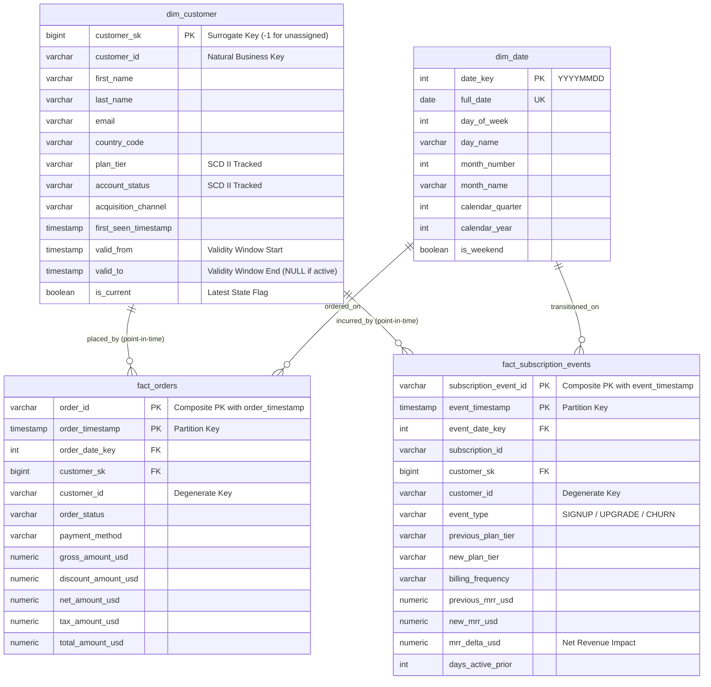

# Analytical Data Architecture & Modeling Specification

## 1. Executive Summary & Design Philosophy
This document formalizes the dimensional architecture for the **End-to-End Analytics Data Platform**. The platform unifies high-velocity transactional ecommerce orders (~400,000 records) and recurring SaaS subscription lifecycles (~200,000 records), supported by customer digital touchpoints (~400,000 records), scaling to an aggregate baseline of **1,000,000+ source records**.

Our design adheres to the **Kimball Dimensional Modeling methodology**, prioritizing:
1. **Analytic Usability**: Simple, intuitive schemas for business intelligence (BI) tooling, SQL analysts, and reporting dashboards.
2. **Historical Fidelity**: Uncompromising accuracy via **Slowly Changing Dimensions (SCD Type II)** on customer entities, avoiding retroactive attribution distortion.
3. **Scan Efficiency & Cost Pruning**: Declarative range partitioning and indexed access patterns designed to eliminate full-table scans over large record volumes.

---

## 2. Architecture Comparison & Trade-Off Matrix

Choosing the serving layer structure requires balancing query performance, storage overhead, and maintenance complexity:

| Architecture Pattern | Query Performance | Storage Overhead | Schema Evolution & Maintenance | Fit for Unified Ecommerce + SaaS |
| :--- | :--- | :--- | :--- | :--- |
| **Star Schema (Chosen)** | **High**: Predictable, clean joins between facts and conformed dimensions; optimal for BI engines. | **Low**: Dimension deduplication preserves normalized attributes without wasteful repetition. | **Moderate**: Clean separation of concerns between entities; dimensions evolve independently. | **Optimal**: Cleanly reconciles two distinct fact grains (Orders vs. Subscription Events) against a shared Customer dimension. |
| **Snowflake Schema** | **Moderate**: Multi-hop joins (e.g. `fact -> customer -> geography -> region`) increase compute latency. | **Lowest**: Highly normalized; minimal redundancy. | **High**: Schema fragility across complex join trees; frustrating for ad-hoc business analytics. | **Sub-optimal**: Unnecessary join overhead for a 1M record dataset with zero performance advantage. |
| **One Big Table (OBT)** | **High**: Zero joins for single-table reads; excellent for columnar OLAP (e.g. BigQuery/ClickHouse). | **High**: Massive column repetition (customer address, tier, channel repeated across 1M rows). | **Poor**: High update anomaly risk when backfilling or modifying customer metadata; impossible to cleanly represent multi-grain facts. | **Poor**: Merging orders and subscription events into one flat table introduces dense null columns and semantic confusion. |

**Decision**: We implement a **Dimensional Star Schema** centered on conformed dimensions (`dim_customer`, `dim_date`) serving two distinct transactional and lifecycle facts (`fact_orders`, `fact_subscription_events`).

---

## 3. Explicit Table Grain Statements

> *"If two engineers read your grain statement differently, it is not written yet."*

### `marts.dim_customer`
* **Grain Statement**: **Exactly one row represents a distinct customer profile state over a contiguous, non-overlapping span of time.**
* **Boundary Rules**: A new row is generated whenever a tracked business attribute changes (e.g., `plan_tier`, `account_status`, or `country_code`). Previous versions are closed by setting `valid_to` to the change timestamp and updating `is_current = FALSE`.

### `marts.fact_orders`
* **Grain Statement**: **Exactly one row represents a single completed, cancelled, or refunded ecommerce order transaction.**
* **Boundary Rules**: Line items are aggregated to the order boundary for this mart; every row maps to a discrete customer point-in-time surrogate key and unique monetary total.

### `marts.fact_subscription_events`
* **Grain Statement**: **Exactly one row represents a single discrete SaaS subscription contract transition (Signup, Renewal, Upgrade, Downgrade, or Churn).**
* **Boundary Rules**: Captures state changes, previous vs. new plan tiers, and exact Monthly Recurring Revenue (MRR) delta produced at that precise instant.

### `marts.dim_date`
* **Grain Statement**: **Exactly one row represents a single calendar day in UTC.**
* **Boundary Rules**: Spans continuous dates across historical and projected operational windows without gaps.

---

## 4. Entity-Relationship Diagram (ERD)



---

## 5. Slowly Changing Dimension (SCD Type II) Mechanics

Customer behavior in a hybrid model evolves dynamically: customers upgrade from `FREE` to `PRO`, downgrade, change billing countries, or reactivate accounts. Overwriting these records (SCD Type I) distorts historical financial reporting (e.g. reporting orders placed when a user was on `FREE` as if they occurred under `ENTERPRISE`).

### Temporal Tracking Attributes
* `valid_from TIMESTAMP WITH TIME ZONE NOT NULL`: Marks the moment an attribute permutation became active.
* `valid_to TIMESTAMP WITH TIME ZONE NULL`: Marks the moment the state was superseded. `NULL` explicitly denotes the ongoing active version.
* `is_current BOOLEAN NOT NULL DEFAULT TRUE`: Provides a binary indexing vector for fast lookups of latest state.

### Production Guardrails Implemented
1. **Active Record Uniqueness Guarantee**:
   To prevent pipeline concurrency bugs from creating duplicate active records, we enforce a **partial unique index**:
   ```sql
   CREATE UNIQUE INDEX uq_dim_customer_active_version 
   ON marts.dim_customer (customer_id) 
   WHERE is_current = TRUE;
   ```
2. **Orphan Record Resolution**:
   If an order or telemetry record arrives before the customer profile lands in ingestion, foreign key constraints or inner joins would discard financial figures. We seed a permanent fallback record:
   ```sql
   customer_sk = -1, customer_id = 'UNKNOWN', plan_tier = 'UNKNOWN'
   ```
   Incomplete source records join to `-1`, ensuring 100% financial reconciliation.

### Downstream Join Patterns

#### Pattern A: Point-in-Time Historical Accuracy (Default)
Matches transactions to the customer tier in effect at the exact moment of purchase:
```sql
SELECT 
    d.plan_tier,
    COUNT(f.order_id) AS total_orders,
    SUM(f.net_amount_usd) AS net_revenue
FROM marts.fact_orders f
JOIN marts.dim_customer d 
  ON f.customer_id = d.customer_id
 AND f.order_timestamp >= d.valid_from 
 AND (f.order_timestamp < d.valid_to OR d.valid_to IS NULL)
GROUP BY 1;
```

#### Pattern B: Current-State Cohort Attribution
Groups historical orders by the customer's current status:
```sql
SELECT 
    d.plan_tier AS current_tier,
    SUM(f.net_amount_usd) AS lifetime_historical_revenue
FROM marts.fact_orders f
JOIN marts.dim_customer d 
  ON f.customer_id = d.customer_id
 AND d.is_current = TRUE
GROUP BY 1;
```

---

## 6. Partitioning, Indexing, and Scan-Pruning Strategy

### Declarative Range Partitioning
Both `fact_orders` and `fact_subscription_events` implement **monthly range partitioning** on their UTC timestamp columns (`order_timestamp` and `event_timestamp`).

* **Why Monthly?** 
  Across 1,000,000 records, daily partitioning introduces excessive small tables (365 partitions/year), leading to inode bloat and query planner overhead. Annual partitioning leaves partitions too large (~500k rows each). Monthly partitioning (~30,000–80,000 rows/partition) achieves optimal query pruning for typical 30-day, monthly close, and trailing-quarter queries.
* **The `DEFAULT` Partition Safety Net**:
  In PostgreSQL, an insert with a timestamp outside defined partition bounds will fail the entire batch. Both tables include a `DEFAULT` partition (`fact_orders_default`, `fact_subscription_events_default`) ensuring that historical backfills or delayed event streams never abort pipeline execution.

### Composite Primary Key Architecture
PostgreSQL declarative partitioning requires all partition keys to belong to the table's primary key. We establish composite primary keys:
* `fact_orders`: `PRIMARY KEY (order_id, order_timestamp)`
* `fact_subscription_events`: `PRIMARY KEY (subscription_event_id, event_timestamp)`

### Indexing Rationale
* **Customer Journey Traversal**: Composite index on `(customer_sk, order_timestamp)` powers sub-millisecond retrieval of user transaction timelines.
* **Chronological Slicing**: Index on `order_date_key` accelerates joins against `dim_date` fiscal calendars.
* **SCD Lookup Speed**: Partial B-Tree index on `dim_customer (customer_id, valid_from, valid_to)` enables rapid range filtering during dbt transformation builds.
