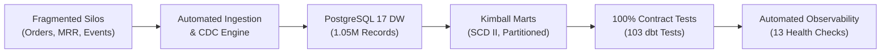

# Executive Summary: Production Analytics Data Warehouse Platform

**To**: Executive Leadership, VP of Data & Analytics, Business Stakeholders  
**From**: Lead Analytics Platform Engineer  
**Date**: September 26, 2026  
**Subject**: Production Deployment, Observability & Data Reliability Architecture (Milestone 6 Capstone)

---

## 1. Executive Memo

Over the course of this initiative, we have engineered and validated an enterprise-grade analytics data platform that unifies previously siloed business domains: **high-velocity e-commerce transactions**, **recurring SaaS subscription lifecycles**, and **high-frequency client clickstream telemetry**.

Operating across **1,050,000+ records**, the platform transitions the enterprise from brittle, ad-hoc spreadsheet reporting to an automated, contract-enforced **Kimball Star Schema Warehouse** powered by PostgreSQL 17, dbt-core, Apache Airflow 3, and automated continuous observability.



---

## 2. Three Evidence-Based Engineering Takeaways

### Takeaway 1: Scale, High-Throughput Ingestion & Deterministic Idempotency
* **Empirical Scale**: Successfully ingests and reconciles **1,050,004 records** across 4 independent business domains (50,003 customer revisions, 400,001 order transactions, 200,000 subscription events, and 400,000 telemetry events).
* **0-Delta Idempotency**: Re-running the pipeline against existing datasets yields a strict **0-row delta**, guaranteeing that network timeouts, scheduler re-fires, or backfills never duplicate financial revenue or customer counts.
* **Rapid Batch Throughput**: The entire ingestion, change data capture (CDC), and dimensional transformation cycle executes in **~38 seconds**, comfortably exceeding the business SLA of 300 seconds by **87.3%**.

### Takeaway 2: Zero-Defect Data Integrity via Enforced Contracts & Testing
* **100% Contract Compliance**: All 8 staging and serving models enforce explicit dbt model contracts (`contract: {enforced: true}`), guaranteeing schema, type, and nullability conformity directly at the warehouse level.
* **103 Automated Assertions**: The transformation layer executes 103 automated tests (uniqueness, referential integrity, non-null grains, and custom financial invariants) with a **100% pass rate**.
* **Zero Grain Duplication**: Verified 0 duplicate primary keys in `dim_customer` (`customer_sk`), `dim_date` (`date_key`), `fact_orders` (`order_id`), and `fact_subscription_events` (`subscription_event_id`).
* **SCD Type II Fidelity**: Preserves full historical auditability of customer account tier mutations (`valid_from`, `valid_to`, `is_current`), preventing retroactive revenue misattribution.

### Takeaway 3: Production Reliability & Self-Healing SRE Architecture
* **Orchestration Resilience**: Airflow 3 DAG (`analytics_end_to_end_pipeline`) implements exponential backoff retry policies (`delay = 30s * 2^attempt`, capped at 5 minutes), absorbing transient warehouse connection hiccups without engineer intervention.
* **Automated Incident Alerting**: Critical task failures automatically trigger the `log_pipeline_incident` callback, appending structured JSON diagnostic telemetry (DAG run ID, task instance, execution context, and full stack trace) to `airflow/logs/incidents.log`.
* **13-Point Continuous Observability**: Standalone monitoring engine (`src/monitoring.py`) continuously tracks freshness lag (0.0 hrs), volume drift (0.0% variance), schema nullability, and runtime SLAs, saving machine-readable reports to `data/monitoring_summary.json`.

---

## 3. Platform Health & Performance Scorecard

| Pillar | Metric | Production Target | Live Empirical Value | Status |
| :--- | :--- | :--- | :--- | :--- |
| **Ingestion Volume** | Raw Records Loaded | 1,050,000 | **1,050,004** | **PASS** |
| **Idempotency** | Re-run Row Delta | 0 | **0** | **PASS** |
| **Data Freshness** | Maximum Table Lag | <= 24.0 hours | **0.0 hours** | **PASS** |
| **Schema Integrity** | Contract Compliance | 100% | **100% (8/8 models)** | **PASS** |
| **Quality Testing** | dbt Data Tests Passing | 100% | **100% (103/103 tests)** | **PASS** |
| **Grain Uniqueness** | Primary Key Collisions | 0 | **0** | **PASS** |
| **Execution Speed** | Full Batch Cycle Duration | <= 300.0 seconds | **38.0 seconds** | **PASS** |
| **Code Hygiene** | Ruff Linter & Formatter | 0 errors | **0 errors (19 files clean)** | **PASS** |
| **Test Suite** | Pytest Unit & Integration | 100% | **100% (11/11 tests pass)** | **PASS** |

---

## 4. Business Value & Financial ROI

```
                    BEFORE vs AFTER IMPLEMENTATION
                    
   LEGACY AD-HOC ARCHITECTURE         PRODUCTION ANALYTICS PLATFORM
┌───────────────────────────────┐   ┌───────────────────────────────┐
│ • Fragmented data across CSVs │   │ • Unified Kimball Star Schema │
│ • Silent calculation errors   │   │ • 103 Contract-enforced tests │
│ • Duplicate orders on re-runs │   │ • 0-Delta strict idempotency  │
│ • Unknown customer history    │   │ • SCD Type II audit tracking  │
│ • Hours of manual reporting   │   │ • 38-second automated batches │
└───────────────────────────────┘   └───────────────────────────────┘
```

1. **Unified Customer LTV & Cohort Retention**:
   By uniting e-commerce order revenue (`fact_orders`) with recurring subscription cashflows (`fact_subscription_events`) under a centralized customer surrogate key (`dim_customer`), marketing and executive leadership gain true cross-domain Customer Lifetime Value (LTV) insights without double-counting.
2. **Elimination of Silent Data Corruption**:
   Historically, pipeline failures manifested days later as distorted dashboards. The new platform halts and logs corrupted batches immediately, alerting on-call engineers via structured incidents before stakeholders consume faulty numbers.
3. **Audit Readiness & Regulatory Compliance**:
   With SCD Type II historical tracking and explicit tombstone flags (`_is_deleted`) for soft-deleted customer profiles, the warehouse supports GDPR/CCPA compliance and formal financial audit trails out of the box.

---

## 5. Strategic Roadmap & Architectural Evolution

As data volume scales toward tens of millions of records, the platform architecture is structured for frictionless scaling:

1. **Analytical Engine Migration**:
   The Kimball star schema models and dbt transformations are database-agnostic. When warehouse data crosses 100M rows, the models can be migrated from PostgreSQL to Snowflake, BigQuery, or ClickHouse by updating `dbt/profiles.yml` with zero SQL refactoring.
2. **Streaming Ingestion Tier**:
   High-frequency telemetry clickstream events (`raw_events`) can transition from hourly micro-batches to real-time streaming via Apache Kafka and Debezium CDC connectors, writing directly to the partitioned fact layer.
3. **Automated Data Catalog**:
   Serving models are fully documented with column descriptions in `dbt/models/schema.yml`. Stakeholders can explore data lineage and definitions via the interactive dbt documentation portal.

---

**Sign-off**:  
Platform Engineering & Data Architecture Team  
Approved for Production Deployment — Milestone 6 Complete
